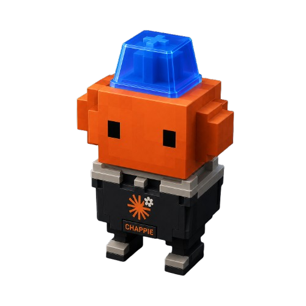

<p align="center">
  
</p>

# Chappie

> Dynamic mechanical keyboard sounds for Claude Code

**Chappie** is a [Claude Code plugin](https://code.claude.com/docs/en/plugins) that plays **realistic Blue Switch mechanical keyboard sounds** while Claude is actively generating responses or executing tools. When Claude needs your permission (tool approval), the typing pauses and a pleasant **alert ding** plays instead.


## Features 

| Feature | Description |
|---|---|
| **Workaholic Rhythm** | Flow-state typing model — sprint/cruise/deliberate bursts, fast finger-rolls, in-word acceleration, occasional typo + backspace corrections, and sentence-length cadence |
| **Permission Alert** | Gentle notification ding when Claude halts for user approval — typing pauses instantly |
| **Zero-Config Audio** | Sound assets are downloaded on first run (via `curl`/`wget`) and cached in `~/.claude/sounds/` — nothing is embedded or shipped |
| **Rust-Powered Daemon** | Cross-platform audio engine using `rodio` (WASAPI / CoreAudio / ALSA); only two crates (`rodio`, `rand`) |
| **Windows EcoQoS** | Daemon opts into Windows efficiency mode + below-normal priority to stay light on battery and CPU |
| **Native Hooks** | Uses Claude Code lifecycle hooks (`UserPromptSubmit`, `PreToolUse`, `PostToolUse`, `Notification`, `Stop`, `SessionEnd`) |
| **Plugin Skills** | Built-in `/chappie:setup` and `/chappie:status` skills |

---

## Installation 

Chappie needs **no build step and no Rust toolchain**. Install the plugin, and
the audio daemon downloads itself automatically the next time a Claude Code
session starts.

### From a Marketplace

If a marketplace includes Chappie:

```
/plugin install chappie@<marketplace-name>
```

### From this repository's marketplace

```
/plugin marketplace add Mic-360/chappie
/plugin install chappie@chappie-marketplace
```

### From GitHub directly

```
claude --plugin-url https://github.com/Mic-360/chappie
```

### That's it

After installing, **do nothing else**. On the next session, Chappie's
`SessionStart` hook runs a small bootstrap script that downloads the prebuilt
`chappie-daemon` binary for your platform (Windows, Linux, or macOS — Intel or
ARM) from the [GitHub Releases](https://github.com/Mic-360/chappie/releases)
and caches it inside the plugin. From that session onward, start typing with Claude and you will hear it.

If Chappie stays silent, run `/chappie:setup` to repair the install, or check
`/chappie:status`. The bootstrap log lives at
`~/.claude/.chappie_state/bootstrap.log`.

### Build from source (contributors only)

You only need this if you are developing Chappie or are offline with no
published release available. It requires the [Rust toolchain](https://rustup.rs):

```bash
git clone https://github.com/Mic-360/chappie.git
cd chappie
cargo build --release
```

The bootstrap script also falls back to `cargo build` automatically if a
download fails and Rust is installed.

---

## Plugin Structure

```
chappie/
├── .claude-plugin/
│   ├── plugin.json            # Plugin manifest (name, version, author, etc.)
│   └── marketplace.json       # Marketplace definition for distribution
├── .github/
│   └── workflows/
│       └── release.yml        # CI: builds & publishes prebuilt binaries
├── hooks/
│   └── hooks.json             # Claude Code lifecycle hook definitions
├── scripts/
│   ├── chappie-bootstrap.sh   # Auto-download the daemon (Linux/macOS)
│   └── chappie-bootstrap.cmd  # Auto-download the daemon (Windows)
├── skills/
│   ├── setup/
│   │   └── SKILL.md           # /chappie:setup — repair / reinstall the daemon
│   └── status/
│       └── SKILL.md           # /chappie:status — check daemon health
├── src/
│   └── main.rs                # Rust audio daemon + `signal` hook entry point
├── docs/
│   └── RELEASING.md           # Maintainer release guide
├── Cargo.toml                 # Rust project manifest
├── LICENSE                    # MIT + third-party attribution
├── .gitignore
└── README.md
```

---

## How It Works

### Architecture

```
┌──────────────────┐  chappie-daemon       ┌────────────────────────┐
│  Claude Code     │  signal <name>        │ ~/.claude/             │
│  Hooks           │ ─────────────────────▶ │ .chappie_state/signal  │
│  (hooks.json)    │  writes "<nonce> <sig>"└────────────┬───────────┘
└──────────────────┘  + spawns daemon                   │ polls
                                                        ▼
                                          ┌────────────────────────┐
                                          │  chappie-daemon (Rust)  │
                                          │                         │
                                          │  • Downloads + caches   │
                                          │    WAV assets           │
                                          │  • Workaholic rhythm    │
                                          │    engine               │
                                          │  • rodio audio output   │
                                          │  • Single-instance lock │
                                          └─────────────────────────┘
```

The hooks invoke the **same compiled binary** in a lightweight `signal` mode
(`chappie-daemon signal <name>`). The binary itself is platform-specific, but
it is fetched automatically: a `SessionStart` hook runs one of two paired
bootstrap scripts — `scripts/chappie-bootstrap.sh` on Linux/macOS and
`scripts/chappie-bootstrap.cmd` on Windows. The script that does not match the
host exits without effect (it may write a harmless error to the hook's
output), so only the correct one does any work. Each script resolves its
paths relative to the plugin directory, so the behavior is identical wherever
Claude Code installs the plugin.

Each write carries a unique **nonce**, so the daemon reacts to every signal
exactly once and never has to clear the file — concurrent hook invocations can
no longer clobber an `alert` or `stop`.

### Hook → Signal Mapping

| Claude Code Event    | Signal Written | Daemon Behavior                          |
|----------------------|----------------|------------------------------------------|
| `UserPromptSubmit`   | `start`        | Begin playing typing sounds              |
| `PreToolUse`         | `typing`       | Continue/resume typing sounds            |
| `PostToolUse`        | `typing`       | Continue/resume typing sounds            |
| `Notification`       | `alert`        | Pause typing → play alert ding → idle    |
| `Stop`               | `stop`         | Return to idle, silence                  |
| `SessionEnd`         | `quit`         | Shut the daemon down immediately         |

### Sound Sources

| Sound           | Source                                                          | License          |
|-----------------|-----------------------------------------------------------------|------------------|
| Key clicks (×4) | [Nigh/OpenClickSound](https://github.com/Nigh/OpenClickSound)  | CC BY-NC 4.0     |
| Spacebar        | [Nigh/OpenClickSound](https://github.com/Nigh/OpenClickSound)  | CC BY-NC 4.0     |
| Alert ding      | [akx/Notifications](https://github.com/akx/Notifications)      | CC0 / CC BY 3.0  |

The 6 WAV assets are downloaded once (via `curl`, falling back to `wget`) and
cached in `~/.claude/sounds/`. No TLS crate is bundled — `curl` ships on modern
Windows 10+, macOS, and virtually every Linux.

---

## Typing Rhythm 


The daemon models a fast, fluent **workaholic typist** rather than uniform
random clicks. It drifts between three flow states and layers human detail on
top:

- **Flow states** — *Sprint* (45–78 ms/key), *Cruise* (62–112 ms), *Deliberate*
  (95–175 ms), re-rolled every 10–30 words and weighted heavily toward speed.
- **Finger rolls** — words occasionally open with a 2–4 key burst at ~30 ms.
- **In-word acceleration** — slow on the first key, fastest mid-word, easing off
  at the end.
- **Typo corrections** — ~6% of words trigger a fast backspace rattle + retype.
- **Cadence** — short word gaps, longer sentence breaths every 8–16 words, rare
  thinking pauses.

## Tuning 


Modify the rhythm constants at the top of `src/main.rs` and rebuild:

| Constant                       | Default       | Description                              |
|---------------------------------|---------------|------------------------------------------|
| `ROLL_CHANCE`                   | `0.22`        | Chance a word opens with a finger-roll   |
| `TYPO_CHANCE`                   | `0.06`        | Chance of a typo + correction per word   |
| `WORD_LEN_MIN` / `WORD_LEN_MAX` | `2` / `9`     | Word-length range (skewed short)         |
| `MIN_PITCH` / `MAX_PITCH`       | `0.92`/`1.08` | Pitch randomization range                |
| `MIN_VOLUME` / `MAX_VOLUME`     | `0.62`/`1.0`  | Volume randomization range               |
| `IDLE_SHUTDOWN_MS`              | `15000`       | Idle time before the daemon self-exits   |

Per-flow-state timing lives in `Flow::params()`.

---

## Development 


```bash
cargo build --release
cargo test            # unit tests for the rhythm engine

# Drive the daemon manually — the same `signal` mode the hooks use.
# Each call writes the signal and launches the daemon if needed.
BIN=./target/release/chappie-daemon   # chappie-daemon.exe on Windows
"$BIN" signal start     # start typing (also spawns the daemon)
sleep 5
"$BIN" signal alert     # pause typing, play the alert ding
sleep 2
"$BIN" signal typing    # resume typing
sleep 5
"$BIN" signal quit      # shut the daemon down immediately
```

> The signal file holds `<nonce> <signal>`; `signal` mode generates the nonce
> for you. The daemon logs to `~/.claude/.chappie_state/daemon.log`.

### Testing the Plugin Locally

```bash
claude --plugin-dir ./chappie
# Then use:
#   /chappie:setup    — repair / reinstall the daemon
#   /chappie:status   — check daemon health
```

---

## Marketplace Distribution 


### Publishing to the Official Marketplace

Submit at:
- **Claude.ai:** [claude.ai/settings/plugins/submit](https://claude.ai/settings/plugins/submit)
- **Console:** [platform.claude.com/plugins/submit](https://platform.claude.com/plugins/submit)

### Hosting a Custom Marketplace

This repo includes `.claude-plugin/marketplace.json`. To use it as a marketplace:

```
/plugin marketplace add Mic-360/chappie
/plugin install chappie@chappie-marketplace
```

### Including in a Team Marketplace

Add to your team's `marketplace.json`:

```json
{
  "name": "chappie",
  "source": {
    "source": "github",
    "repo": "Mic-360/chappie"
  },
  "description": "Mechanical keyboard sounds for Claude Code",
  "category": "productivity",
  "tags": ["audio", "ambient"]
}
```

---

## License

**Plugin code:** [MIT](LICENSE)

**Sound assets:** Sourced under their respective licenses — see the [Sound Sources](#sound-sources) table and the [LICENSE](LICENSE) file.

## Credits 


- **Audio Engine:** [rodio](https://github.com/RustAudio/rodio) — RustAudio team
- **Key Sounds:** [Nigh/OpenClickSound](https://github.com/Nigh/OpenClickSound) — Free live-recorded key tones
- **Alert Sound:** [akx/Notifications](https://github.com/akx/Notifications) — Hand-crafted notification tones
